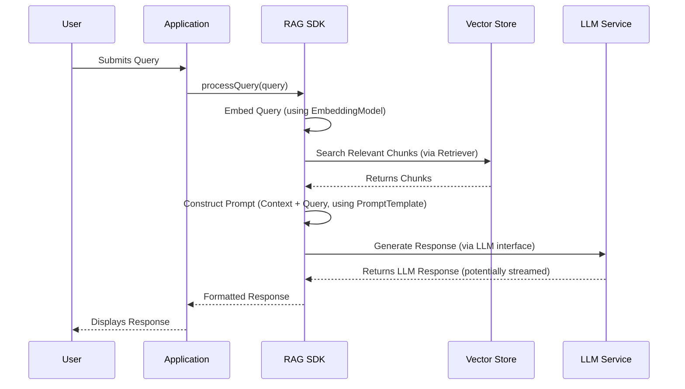
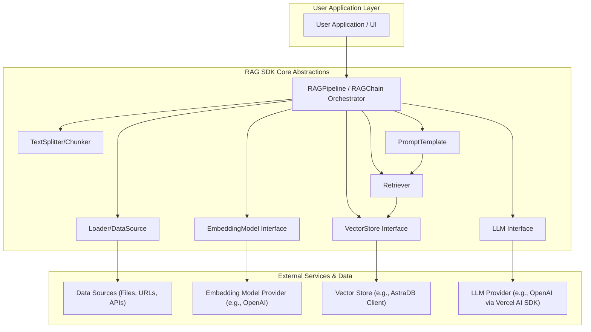

# ARCHITECTURE

This document outlines the basic architecture for a Retrieval-Augmented Generation (RAG) SDK designed to help users easily implement RAG instances. The design is informed by common RAG patterns, such as those described in tutorials like building a RAG chatbot with LangChain.js and Next.js.

## Core Components of a RAG System

A typical RAG system, as often implemented for chatbots or question-answering systems, involves several key components that work together to retrieve relevant information and generate informed responses. An SDK for RAG aims to simplify the integration and management of these components.

1.  **Data Ingestion & Processing:**
    *   **Connectors:** Mechanisms to connect to various data sources (e.g., local files like PDFs/text, web URLs, databases like DataStax Astra).
    *   **Loaders & Parsers:** Tools for loading raw data and parsing it into a usable format (e.g., extracting text from documents).
    *   **Chunking:** Strategies to split large documents into smaller, manageable chunks suitable for embedding and retrieval.
    *   **Embedding Generation:** Modules for transforming text chunks into vector embeddings using models (e.g., from OpenAI or open-source alternatives). This is crucial for semantic search.

2.  **Vector Store Management:**
    *   **Abstraction Layer:** A consistent API for interacting with various vector databases (e.g., DataStax Astra, Pinecone, ChromaDB, FAISS, Weaviate, local in-memory stores).
    *   **Storage Operations:** Functions for creating, populating (indexing embeddings), updating, and deleting vector stores or collections within them.
    *   **Metadata Handling:** Support for storing and filtering based on metadata associated with the embeddings.

3.  **Retrieval Mechanism:**
    *   **Query Transformation:** Converting a user's natural language query into a vector embedding using the same model as the document embeddings.
    *   **Similarity Search:** Core logic for searching the vector store to find the most relevant document chunks based on vector similarity (e.g., cosine similarity, dot product).
    *   **Re-ranking (Optional):** Advanced techniques to refine search results before passing them to the LLM.
    *   **Contextualization:** Formatting the retrieved chunks into a coherent context string.

4.  **Augmented Generation (LLM Interaction):**
    *   **LLM Integration:** Connectors for various Large Language Models (LLMs) like OpenAI's GPT series, Anthropic's Claude, or open-source models via interfaces like Hugging Face Transformers.
    *   **Prompt Engineering:** Utilities to construct effective prompts that combine the retrieved context with the user's original query. This might include templates and strategies for context injection.
    *   **Response Generation:** Sending the augmented prompt to the LLM and receiving the generated response.
    *   **Streaming (Optional):** Support for streaming responses from the LLM for better user experience. The Vercel AI SDK provides excellent utilities (like `streamText` and `toAIStreamResponse`) for this in a Node.js/Next.js environment.

5.  **Orchestration & Workflow (The SDK's Core Value):**
    *   **Pipeline Management:** A high-level API or framework to define and run the entire RAG pipeline (e.g., `query -> embed_query -> retrieve_context -> augment_prompt -> generate_response`).
    *   **Configuration Management:** Easy ways to configure API keys, model choices, vector store connections, chunking strategies, etc.
    *   **Caching (Optional):** Mechanisms to cache embeddings or LLM responses to improve performance and reduce costs.
    *   **Logging & Monitoring:** Tools for developers to understand the internal workings and performance of their RAG application.

## SDK Implementation Focus

The RAG SDK will provide modules, classes, and functions to cover these core areas, enabling developers to:

-   **Easily Connect & Process Data:** Provide pre-built loaders and transformers for common data sources and types.
    ```typescript
    // Example (conceptual)
    // Assuming 'sdk' is our RAG SDK namespace
    const dataLoader = new sdk.DataLoader({ sourceType: "web_url", url: "https://en.wikipedia.org/wiki/Formula_One" });
    const documents = await dataLoader.loadAndChunk();
    ```
-   **Simplify Embedding & Storage:** Offer straightforward ways to generate embeddings and store them in a chosen vector store with minimal configuration.
    ```typescript
    // Example (conceptual)
    // Assuming 'sdk' and a VectorStore class/interface. 
    // For Astra DB, this might wrap '@datastax/astra-db-ts'.
    const vectorStore = new sdk.AstraDBVectorStore({
      token: process.env.ASTRA_DB_APPLICATION_TOKEN!,
      endpoint: process.env.ASTRA_DB_API_ENDPOINT!,
      namespace: process.env.ASTRA_DB_NAMESPACE!,
      collectionName: "your_collection_name"
    });
    // Documents would be an array of { pageContent: string, metadata: object }
    await vectorStore.addDocuments(documents, { embeddingModelName: "text-embedding-3-small" });
    ```
-   **Streamline Retrieval & Generation:** Offer a cohesive interface for querying the RAG system.
    ```typescript
    // Example (conceptual)
    // Assuming an RAGPipeline class that might use Vercel AI SDK for streaming
    const ragPipeline = new sdk.RAGPipeline({
      vectorStore: vectorStore, // Instance from above
      llm: openai('gpt-4o'), // Using Vercel AI SDK's OpenAI provider
      embeddingModelName: "text-embedding-3-small" // Consistent model name for embeddings
    });
    // The query method might return a stream or a final response object
    const result = await ragPipeline.query("What were the key F1 rule changes in 2022?");
    // Handle the result, which could be a stream (e.g., result.stream) or text (e.g., result.text)
    // For streaming with Next.js, one might use `result.toAIStreamResponse()` if 'result' is a StreamTextResult object.
    console.log(await result.text()); // Or iterate over a stream
    ```

### Key SDK Abstractions:

-   `DataSource`/`Loader`: For ingesting data.
-   `TextSplitter`/`Chunker`: For preparing data.
-   `EmbeddingModel`: Interface for different embedding providers.
-   `VectorStore`: Interface for different vector databases.
-   `Retriever`: Encapsulates the logic for fetching relevant documents.
-   `LLM`: Interface for different language model providers.
-   `PromptTemplate`: For constructing prompts.
-   `RAGChain`/`RAGPipeline`: To orchestrate the end-to-end process.

## Visualizing the Architecture

### High-Level RAG Flow

This diagram illustrates the typical sequence of operations in a RAG system built with this SDK:



### SDK Component Interactions

This diagram shows the main components of the SDK and their relationships:




## Audience Perspectives

### For Solution Architects

-   **System Integration:** The SDK is designed to be a modular component within a larger application. Key integration points include the `RAGPipeline` (or equivalent orchestrator) for processing queries, `DataLoader` for ingesting data from various enterprise sources, and `VectorStore` / `LLM` interfaces for connecting to preferred backend services.
-   **Technology Choices & Flexibility:** The SDK promotes a decoupled architecture. While examples might use specific technologies (like OpenAI, Astra DB, Vercel AI SDK), the core interfaces (`EmbeddingModel`, `VectorStore`, `LLM`) are designed to be adaptable. Architects can guide the implementation of custom adapters for different embedding models, vector databases (e.g., on-premise solutions), or LLMs.
-   **Scalability & Performance:** Consider the scalability of chosen vector store and LLM providers. For data ingestion, the chunking strategy and embedding process can be parallelized or batched. Caching mechanisms (as mentioned in Core Components) can be critical for performance and cost optimization at scale.
-   **Security:** API keys and sensitive configurations should be managed securely (e.g., via environment variables, secrets management systems). Data flow, especially with external services, needs to comply with security policies.
-   **Deployment:** The SDK itself is a library. The application using the SDK (like the `examples/web` Next.js app) will have its own deployment considerations (e.g., Vercel, Docker, Kubernetes).

### For Developers (SDK Users & Contributors)

-   **Core API:** The primary interaction point will likely be the `RAGPipeline` or a similar high-level orchestrator. Developers will configure this pipeline with specific implementations of `DataLoader`, `VectorStore`, `EmbeddingModel`, and `LLM`.
-   **Ease of Use:** The conceptual examples (e.g., `new sdk.RAGPipeline(...)`) showcase the intended simplicity for common use cases. The SDK aims to abstract boilerplate for connecting to services, managing data flow, and constructing prompts.
-   **Extensibility:**
    -   **Custom DataLoaders:** Implement the `Loader` interface to support new data sources.
    -   **VectorStore Adapters:** Implement the `VectorStore` interface to integrate with different vector databases.
    -   **Embedding Models:** Wrap various embedding API clients with the `EmbeddingModel` interface.
    -   **LLM Wrappers:** Implement the `LLM` interface for new language model providers or custom logic.
-   **TypeScript & Modularity:** The SDK is built with TypeScript, providing strong typing and better developer experience. Code is organized into modules for clear separation of concerns.
-   **Examples as Guidance:** The `examples/web` application serves as a practical, end-to-end reference for using the SDK's principles in a real application, including handling streaming and frontend integration.

### For Project Managers

-   **Value Proposition:** This SDK accelerates the development of RAG-powered applications by providing pre-built, reusable components and abstracting common complexities. This reduces time-to-market for features like semantic search, Q&A over custom documents, and intelligent chatbots.
-   **Key Capabilities:**
    -   Ingestion from various data sources.
    -   Automated text chunking and embedding.
    -   Integration with multiple vector stores and LLMs (via interfaces).
    -   Orchestration of the retrieval and generation process.
    -   Support for modern development practices (TypeScript, environment-based configuration).
-   **Project Impact:** Enables teams to focus on domain-specific logic and user experience rather than low-level RAG plumbing. Facilitates experimentation with different models and data sources.
-   **Development Phases (Potential):**
    1.  **Core SDK Development:** Building out the stable interfaces and core components.
    2.  **Connector/Adapter Implementation:** Adding support for specific data sources, vector stores, and LLMs required by target projects.
    3.  **Application Integration:** Integrating the SDK into end-user applications (e.g., internal knowledge bases, customer support bots).
-   **Resource Management:** While the SDK simplifies development, projects will still require resources for data preparation, API costs (OpenAI, LLMs), vector database hosting, and application development.

This SDK aims to lower the barrier to entry for building robust and customizable RAG applications by abstracting away much of the underlying complexity while still offering flexibility for advanced users.