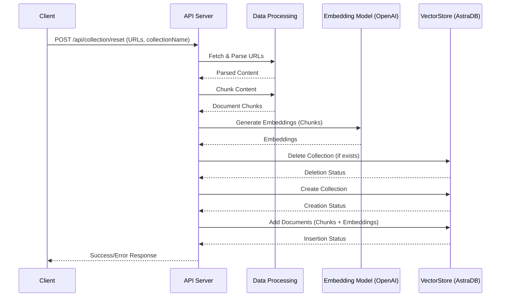
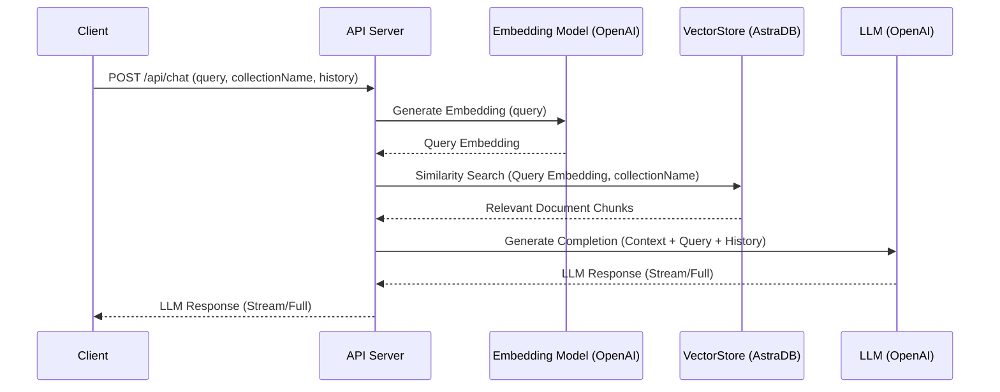
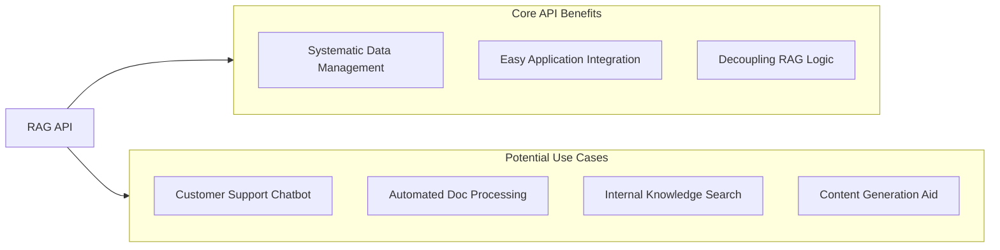

# RAG SDK API Documentation

This document outlines the API for interacting with the RAG (Retrieval Augmented Generation) SDK. The API provides endpoints for managing the data lifecycle within a vector database (AstraDB) and for querying the RAG system to get AI-generated responses based on your documents.

This API is designed to encapsulate the core functionalities demonstrated in the `scripts` directory, such as data ingestion, embedding, storage, and retrieval, making them accessible via HTTP endpoints.

## Table of Contents

- [Setup](#setup)
- [Architecture Perspective](#architecture-perspective)
- [Developer Perspective](#developer-perspective)
- [Project Manager Perspective](#project-manager-perspective)

## Setup

Before running the API server, ensure you have the following set up:

1.  **Clone the Repository & Install Dependencies:**
    ```bash
    # If you haven't already
    git clone <repository_url>
    cd rag-sdks
    pnpm install
    ```

2.  **Environment Variables:**
    Create a `.env` file in the root of the `rag-sdks` project with the following variables. These are essential for the API to connect to external services (AstraDB, OpenAI) and configure its behavior.
    
    For more information on how to configure these variables, see the [CONFIG.md](docs/CONFIG.md) file.

3.  **Run the API Server:**
    Assuming the API is implemented within a Next.js application (as typical in `examples/web`):
    ```bash
    cd examples/web # Or wherever your Next.js app with the API routes is
    pnpm dev
    ```
    The API endpoints will typically be available under `http://localhost:3000/api/...`.

## Architecture Perspective

### Overview

The API serves as a bridge between external clients and the RAG SDK's core functionalities. It orchestrates data processing, interaction with the vector database (AstraDB), and communication with the language model service (OpenAI).

### Components

1.  **API Server:** An HTTP server (e.g., Next.js API Routes, Express.js) that exposes endpoints for client interaction.
2.  **RAG SDK Core:** The underlying TypeScript library (`rag-sdks/src`) containing:
    *   `VectorStore`: Interface and implementation (e.g., `AstraDBStore`) for managing and querying vectorized data in AstraDB.
    *   `EmbeddingModel`: Interface and implementation (e.g., `OpenAIEmbeddingAdapter`) for generating text embeddings.
    *   `LLM`: Interface and implementation for interacting with Large Language Models (e.g., OpenAI's chat completions).
3.  **External Services:**
    *   **AstraDB:** A cloud-native vector database used for storing and searching document embeddings.
    *   **OpenAI API:** Used for generating text embeddings and providing chat completions.
4.  **Data Processing Utilities:** Internal logic (inspired by `scripts/reset.ts`) for fetching web content, parsing, chunking text, and preparing documents for embedding and storage.

### Data Flow

**1. Data Ingestion & Reset (e.g., `/api/collection/reset` endpoint):**
   - Client sends a POST request, optionally specifying URLs and a collection name.
   - API server invokes data processing logic:
     - Fetches content from specified URLs (or default URLs from `.env`).
     - Parses HTML/text to extract meaningful content.
     - Chunks the content into manageable pieces.
     - Uses the `EmbeddingModel` (OpenAI) to generate embeddings for each chunk.
     - Interacts with AstraDB via the `VectorStore`:
       - Deletes the target collection if it exists.
       - Creates a new collection with the appropriate vector dimension.
       - Inserts the documents (chunks with their embeddings and metadata) into the collection.
   - API server returns a status response to the client.

**2. Chat/Query (e.g., `/api/chat` endpoint):**
   - Client sends a POST request with a user query (and optionally, chat history).
   - API server uses the `VectorStore`:
     - Generates an embedding for the user's query using the `EmbeddingModel`.
     - Performs a similarity search in the specified AstraDB collection to find relevant document chunks.
   - API server constructs a prompt for the LLM, including the retrieved document chunks as context and the user's query.
   - Uses the `LLM` class to send the prompt to OpenAI and get a response.
   - API server streams or sends the LLM's response back to the client.

### Technologies

-   Node.js & TypeScript
-   Next.js (for API routes, if following `examples/web` pattern) or Express.js
-   `@datastax/astra-db-ts` for AstraDB interaction
-   `openai` SDK for OpenAI API interaction
-   `axios` for fetching web content
-   `jsdom` for HTML parsing (if scraping HTML content)

### Visual Overview

**1. High-Level System Architecture:**

```mermaid
graph TD
    Client[External Client/Application] -->|HTTP Request| APIServer[API Server (Next.js/Express)]
    APIServer -->|Uses| RAGSDKCore[RAG SDK Core]
    RAGSDKCore -->|Manages/Queries| AstraDB[(AstraDB Vector Store)]
    RAGSDKCore -->|Generates Embeddings/Completions| OpenAI[(OpenAI API)]
    RAGSDKCore -->|Processes Data| DataUtils[Data Processing Utilities]

    subgraph RAG SDK Core
        direction LR
        VS[VectorStore]
        EM[EmbeddingModel]
        LLM[LLM]
    end
    APIServer --> VS
    APIServer --> EM
    APIServer --> LLM
```

**2. Data Ingestion Flow (`/api/collection/reset`):**



**3. Query/Chat Flow (`/api/chat`):**



## Developer Perspective

### API Endpoints

#### 1. Reset and Re-seed Collection

-   **Endpoint:** `POST /api/collection/reset`
-   **Description:** Clears an existing AstraDB collection (if it exists) and re-populates it with documents processed from a list of specified URLs. This is useful for initializing or completely refreshing the knowledge base.
-   **Request Body (JSON):**
    ```json
    {
      "urls": ["https://example.com/doc1", "https://anotherexample.com/doc2"], // Optional. Defaults to URLS_TO_PROCESS from .env if not provided.
      "collectionName": "my_custom_collection" // Optional. Defaults to ASTRA_DB_COLLECTION from .env if not provided.
    }
    ```
-   **Response Body (JSON - Success 200):**
    ```json
    {
      "status": "success",
      "message": "Collection 'your_collection_name' reset and re-seeded successfully.",
      "collectionName": "your_collection_name",
      "documentsProcessed": 150, // Total number of document chunks added
      "urlsProcessed": ["https://example.com/doc1", "https://anotherexample.com/doc2"]
    }
    ```
-   **Response Body (JSON - Error 4xx/5xx):**
    ```json
    {
      "status": "error",
      "message": "A description of the error.",
      "details": "..." // Optional additional error details
    }
    ```
-   **Example cURL:**
    ```bash
    curl -X POST http://localhost:3000/api/collection/reset \
    -H "Content-Type: application/json" \
    -d '{
      "urls": ["https://docs.morpho.org/llms-full.txt"],
      "collectionName": "morpho_docs"
    }'
    ```

#### 2. Chat with RAG System

-   **Endpoint:** `POST /api/chat`
-   **Description:** Submits a user query to the RAG system. The API retrieves relevant documents from the vector store, augments the query with this context, and streams a response from the LLM.
-   **Request Body (JSON):**
    ```json
    {
      "query": "What are vector embeddings?",
      "collectionName": "my_custom_collection", // Optional. Defaults to ASTRA_DB_COLLECTION from .env.
      "chatHistory": [ // Optional. For maintaining conversation context.
        {"role": "user", "content": "Tell me about RAG."},
        {"role": "assistant", "content": "RAG stands for Retrieval Augmented Generation..."}
      ]
    }
    ```
-   **Response Body (Streaming - Vercel AI SDK format):**
    The response is typically a stream compatible with the Vercel AI SDK `useChat` hook. Each chunk in the stream is a piece of the LLM's generated text.
    Refer to Vercel AI SDK documentation for details on handling streaming responses.
-   **Response Body (Non-streaming JSON - Success 200, if streaming is not used):**
    ```json
    {
      "response": "Vector embeddings are numerical representations of text...",
      "sourceDocuments": [
        {"pageContent": "Text snippet from a relevant document...", "metadata": {"url": "source_url", "chunk_index": 0}},
        {"pageContent": "Another relevant text snippet...", "metadata": {"url": "source_url2", "chunk_index": 3}}
      ]
    }
    ```
-   **Example cURL (for a non-streaming JSON response, actual implementation might vary for streaming):**
    ```bash
    curl -X POST http://localhost:3000/api/chat \
    -H "Content-Type: application/json" \
    -d '{
      "query": "Explain vector databases.",
      "collectionName": "docs"
    }'
    ```

### Authentication

-   **External Services:** API keys for OpenAI and AstraDB (`OPENAI_API_KEY`, `ASTRA_DB_APPLICATION_TOKEN`) are managed server-side via environment variables. They are not exposed to the client.
-   **API Endpoints:** The example API presented here does not include its own authentication layer. In a production environment, you would typically secure these endpoints using API keys, JWTs, or other authentication mechanisms appropriate for your application.

### Error Handling

-   The API should return standard HTTP status codes (e.g., 400 for bad requests, 500 for server errors).
-   Error responses should be in JSON format, providing a clear `message` and optionally `details`.
-   Specific errors from downstream services (AstraDB, OpenAI) should be caught and translated into meaningful API error responses.

### SDK Integration

The API routes will import and use the `VectorStore`, `OpenAIEmbeddingAdapter`, and `LLM` classes from the `rag-sdks/src` directory. Configuration for these components (API keys, model names, collection names) will be sourced from environment variables.

### Visual Overview

**1. API Endpoint Interaction Example:**

```mermaid
graph LR
    DeveloperApp[Developer's Application] -->|POST /api/chat (JSON)| RAG_API[RAG API Server]
    RAG_API -->|Streaming Text or JSON Response| DeveloperApp
```

**2. SDK Component Usage in API Handler (e.g., `/api/chat`):**

```mermaid
graph TD
    APIHandler[/api/chat handler] -->|1. Get Query| UserInput[User Query]
    APIHandler -->|2. Instantiate| EmbeddingModelInstance[EmbeddingModel]
    EmbeddingModelInstance -->|3. Generate Query Embedding| OpenAI_Embed[(OpenAI Embeddings)]
    APIHandler -->|4. Instantiate| VectorStoreInstance[VectorStore]
    VectorStoreInstance -->|5. Similarity Search| AstraDB_Search[(AstraDB)]
    AstraDB_Search -->|6. Get Context Chunks| VectorStoreInstance
    APIHandler -->|7. Instantiate| LLM_Instance[LLM]
    LLM_Instance -->|8. Generate Response (Context + Query)| OpenAI_Chat[(OpenAI Chat Completions)]
    OpenAI_Chat -->|9. Stream/Return Response| APIHandler
    APIHandler -->|10. Send to Client| ClientApp[Client Application]
```

## Project Manager Perspective

### Purpose

This API provides a standardized, programmatic interface to the RAG SDK's capabilities. It enables:
-   **Systematic Data Management:** Automate the process of building and updating the knowledge base used by the RAG system.
-   **Application Integration:** Allow various client applications (web apps, mobile apps, backend services) to easily leverage the RAG system for intelligent Q&A and content generation.
-   **Decoupling:** Separates the core RAG logic from specific application implementations.

### Key Features

-   **Collection Reset & Seeding:** Fully refresh the vector database collection from a defined set of source URLs.
-   **Contextual Chat/Querying:** Provide AI-generated responses to user queries, grounded in the documents stored in the vector database.
-   **Configurable:** Behavior can be customized via environment variables (default URLs, collection names, AI models).

### Use Cases

-   **Backend for a Customer Support Chatbot:** Ingest product documentation and FAQs, then use the `/api/chat` endpoint to power a chatbot that answers customer questions.
-   **Automated Document Processing Pipeline:** Regularly update a knowledge base from new or modified documents by calling `/api/collection/reset` via a scheduled job.
-   **Internal Knowledge Base Search:** Provide employees with an intelligent search interface over company documents.
-   **Content Generation Tool:** Integrate with content creation workflows to generate summaries or answer questions based on a corpus of reference material.

### Visual Overview

**1. RAG API Core Benefits & Use Cases:**



### Dependencies & Operational Costs

-   **AstraDB:** Requires an Astra DB instance. Costs are based on usage (storage, read/write operations, data transfer). Refer to DataStax Astra DB pricing.
-   **OpenAI API:** Requires an OpenAI API key. Costs are based on token usage for embeddings and chat completions. Refer to OpenAI pricing.
-   **Hosting:** The API server itself will require hosting (e.g., Vercel, AWS, Google Cloud). Costs depend on the provider and resource usage.

### Maintenance

-   **API Key Management:** Securely manage and rotate API keys for AstraDB and OpenAI.
-   **Dependency Updates:** Regularly update SDKs (`@datastax/astra-db-ts`, `openai`, `rag-sdks` itself) and other Node.js packages.
-   **Monitoring & Logging:** Implement monitoring and logging for API requests, errors, and performance to ensure reliability and troubleshoot issues.
-   **Source Data Management:** Ensure the URLs provided for seeding remain accessible and contain relevant content.

### Future Enhancements (Potential)

-   Endpoint to add individual documents or text snippets without a full reset.
-   Endpoint to delete specific documents.
-   Support for more data sources (e.g., file uploads, direct text input).
-   More granular control over embedding and LLM parameters via API requests.
-   Webhook support for asynchronous processing of large datasets.
-   Enhanced security and rate limiting.

